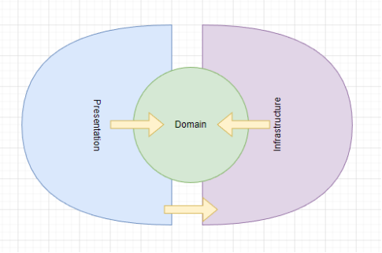
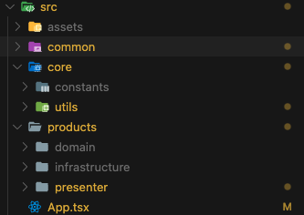
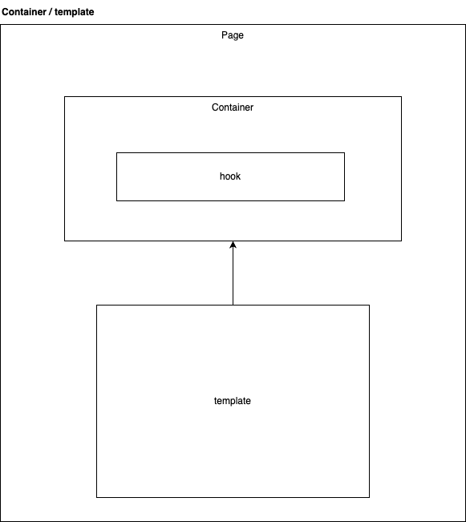

# **React Native - Template - Clean Architecture**

## **Table of contents**

1. [Description](#description)
2. [Objective](#objective)
3. [Project architecture](#project-architecture)
4. [Instalation](#instalation)
5. [Glosary](#glosary)

## **Description**

This React Native template project is designed to follow the principles of a domain-driven clean architecture. Clean architecture is a software development approach that promotes separation of concerns and structured organization of code. By adhering to this architecture, the goal is to maximize scalability, maintainability, and testability of the project.

## **Objective**

Provide a solid and modular project structure that facilitates the development of mobile applications in React Native following the principles of a domain-driven clean architecture.

## **Project architecture**

The architecture is a set of development patterns that allow us to define the guidelines to follow in our software in terms of limits and restrictions. It is the guide that we must follow to order our code and make the different parts of the application communicate with each other. For this project we put together the theory of different architectures in order to guarantee **scalability, single responsibility, high cohesion and low coupling.**

The architectures that were taken as a basis are:

- **Clean architecture**

  Clean Architecture is a software design approach that focuses on separating concerns and achieving independence between the layers of an application. Its main objective is to create highly maintainable, scalable, and testable systems by clearly defining the responsibilities and interactions between different parts of the system. important concepts:

  - Domain: This layer represents the core of the application and contains the business logic and domain rules.
  - Infrastructure: In this layer, the technical details and external tools used in the application are implemented.
  - Presentation: This layer is responsible for the user interface and presenting data to the user.

  <p align="center" width="100%">
    
  </p>

- **Scream architecture**

  The term "scream architecture" is used when we can, just by taking a look at a new project, get a basic idea of what the project does and what it's about

- **Modular architecture**

  As its name indicates the idea of this architecture is to separate the application in modules or delimited contexts which restrict the scope of my functionalities being easier to maintain, this is also called and slice architecture.

### **Structure folder**

Knowing the folder structure will allow us to identify what does what in our project, how it is organized, the configuration files and how we can update or add new features to it.

<p align="center" width="100%">
    
</p>

**but what does each folder and file mean?**

- **Src:** This folder contains all the modules and configurations of the application, is the main feature of our project.

- **Assets:** This folder contains all the statics used by the application, whether they are images, icons, fonts and global style files.

  ```.
  └── assets/
      ├── architectureProyect --> Images used in the documentation
      └── images --> Images used in the application
  ```

- **Common:** This folder contains what is common for the application, from components, views, **models, value objects, repositories, builders**, routes, utilities etc. this component is separated by domain and infrastructure as it says in the architecture section, this behavior has also the modules.
- **Core:** This folder contains what is common to the application and can be used in the different layers of the architecture.
- **App.tsx:** Main component which dynamically renders all the content of the application.

> **Note**: The node_modules folders are not taken into account since they are not stored in the repository. also, the users, auth and patients folders are not mentioned since they are modules and will be discussed in the ["modules in depth"](#in-depth-modules) section.

### **In-depth modules**

A module represents a delimited context in our project, this means that it will address a set of things that are related under the same context, each module will have a domain layer and an infrastructure layer, in addition, they have an index file that will serve as a module manager and will allow me to export or import things from other modules.

```
.
└── Products/
    ├── domain/
    ├── infrastucture/
    └── presenter/

```

_first level of the patiens module folders and files_

### **Domain**

As already explained here we have the rules and business logic, all the code written here will be written in base language (Typescript), in this section it is best not to use third party libraries. the domain contains the following folder structure:

```
.
└── Product/
    └── domain/
        ├── models/
            ├── interface/
            ├── entity/
            └──index
        ├── repositories/
        └── useCases/

```

_Referral patient module_

- **Models**

  Here are all the classes and interfaces related to the module.

  ```ts
  export type ProductEntity = {
    id: string;
    name: string;
    description: string;
    picture: string;
    dateRelease: string;
    dateRevision: string;
  };
  ```

  _Example of the **Product model**_

- **Repository**

  In this folder all the Repositories of the module, these obey [the design pattern repository](https://refactoring.guru/design-patterns/adapter), firstly, it is an abstraction of the data layer and, secondly, it is a way to centralize the management of the domain objects. Works as a contract to be implemented as built, it is widely used in use cases and infrastructure services.

  ```ts
  export interface IProductRepository {
    getProducts(): Promise<ProductEntity[]>;
    addProduct(product: ProductEntity): Promise<void>;
    verificationProduct(productID: string): Promise<boolean>;
    deleteProduct(productID: string): Promise<void>;
    updateProduct(product: ProductEntity): Promise<void>;
  }
  ```

- **UseCase**

  In this folder all the use Cases of the module, These encapsulate the rules of our business, usually the rules are represented by actions, such as create a patient or get patients, as the idea in these use cases is not to apply logic of external implementations what is sought is to reverse the control of this, and using the pattern of injecting dependencies avoid generating instances.

  ```ts
  export class ProductUseCase {
    constructor(readonly repository: IProductRepository) {}

    getProducts = async (): Promise<ProductEntity[]> =>
      await this.repository.getProducts();

    addProduct = async (data: ProductEntity): Promise<void> =>
      await this.repository.addProduct(data);

    verificationProduct = async (productID: string): Promise<boolean> =>
      await this.repository.verificationProduct(productID);

    deleteProduct = async (productID: string): Promise<void> =>
      await this.repository.deleteProduct(productID);

    updateProduct = async (data: ProductEntity): Promise<void> =>
      await this.repository.updateProduct(data);
  }
  ```

### **Infrastucture**

In this layer, the technical details and external tools used in the application are implemented. It includes the logic for accessing databases, web services, file systems, or other similar technologies. The Infrastructure layer communicates with the Domain layer through interfaces defined in the Domain, thus maintaining independence and separation of concerns.

```
.
└── infrastructure/
    ├── models/
    └──repositories/
```

_Infrasctucture folder in patients module_

- **Models:**

  Unlike the domain models these do not need to be self-validated and neither taken to classes in fact here we have interfaces that gives us an abstraction of the objects or data that come to us through the consumption of APIS. as these objects we use them to be transferred usually have the DTO termination.

  ```ts
  export type ProductDto = {
    id: string;
    name: string;
    description: string;
    logo: string;
    date_release: string;
    date_revision: string;
  };
  ```

- **Respositories:**

  The repositories in the infrastructure layer implement the interfaces defined in the domain layer and are responsible for performing data read, write, update, and delete operations. They can also perform necessary transformations or adaptations so that the data conforms to the format required by the technology used.

  ```ts
  export class ProductRepositoryImpl implements IProductRepository {
    constructor(readonly http: IHttp) {}

    getProducts = async (): Promise<ProductEntity[]> => {
      try {
        const response = await this.http.request<ProductDto[]>({
          method: 'get',
          headers: {
            authorId: '10',
          },
          url: `${API_URL}/bp/products`,
        });
        return ProductAdapter.ProductsDtoToEntity(response);
      } catch (error) {
        throw ErrorHandler.fetch(error);
      }
    };

    addProduct = async (product: ProductEntity): Promise<void> => {
      try {
        const body = ProductAdapter.ProductEntityToDto(product);

        await this.http.request<ProductDto>({
          method: 'post',
          headers: {
            authorId: '10',
          },
          body,
          url: `${API_URL}/bp/products`,
        });
      } catch (error) {
        throw ErrorHandler.fetch(error);
      }
    };

    deleteProduct = async (productID: string): Promise<void> => {
      try {
        await this.http.request<void>({
          method: 'delete',
          headers: {
            authorId: '10',
          },
          params: {
            id: productID,
          },
          url: `${API_URL}/bp/products`,
        });
      } catch (error) {
        throw ErrorHandler.fetch(error);
      }
    };

    updateProduct = async (product: ProductEntity): Promise<void> => {
      try {
        const body = ProductAdapter.ProductEntityToDto(product);

        await this.http.request<ProductDto>({
          method: 'put',
          headers: {
            authorId: '10',
          },
          body,
          url: `${API_URL}/bp/products`,
        });
      } catch (error) {
        throw ErrorHandler.fetch(error);
      }
    };
  }
  ```

### **Presenter**

This layer is responsible for the user interface and presenting data to the user. It can include user interface components, views, controllers, or other classes related to presentation. The Presentation layer interacts with the Domain layer through interfaces defined in the Domain, requesting data and sending user actions.

```
.
└── presenter/
    ├── components/
    ├── constans/
    ├── hooks/
    ├── injections/
    ├── navigation/
    ├── pages/
    └── validation/
```

_Infrasctucture folder in patients module_

- **Constans:**

  The "constants" folder in the presenter layer is used to store constant values that are relevant to the presentation logic of the user interface, with the aim of centralizing, organizing, and facilitating their maintenance and usage in the code.

  ```ts
  export enum REQUEST_ID {
    getProducts = 'GET_PRODUCTS',
    addProducts = 'ADD_PRODUCTS',
    verificationProduct = 'VERIFICATION_PRODUCT',
    deleteProduct = 'DELETE_PRODUCT',
    updateProducts = 'UPDATE_PRODUCTS',
  }
  ```

- **Hooks:**

  Custom hooks in the presenter layer are reusable functions that encapsulate logic and state management specific to the presentation of a user interface.

  Custom hooks allow for the extraction and organization of shared code, making it easier to maintain and reuse. They can encapsulate complex logic, data fetching, side effects, or any other behavior needed by components in the presenter layer.

  ```ts
  const useAddProduct = () => {
    const queryClient = useQueryClient();

    return useMutation<void, Error, ProductEntity>(
      [REQUEST_ID.addProducts],
      data => injections.productUseCase.addProduct(data),
      {
        onSuccess: async () => {
          await Promise.all([
            queryClient.invalidateQueries([REQUEST_ID.getProducts]),
          ]);
        },
      },
    );
  };
  ```

- **Injections**

  Dependency injection can be done in various ways in the presenter layer. One common approach is to use design patterns such as constructor injection or property injection.

  By using injections in the presenter layer, it promotes more modular, maintainable, and testable code. Additionally, it facilitates separation of concerns and improves code readability and reusability. Components can receive the necessary dependencies for their operation, making them more flexible and easier to test and maintain.

  ```ts
  const repositoryInfrastructureInstance = repositoryInfrastructure();
  const repositoryInfrastructureProductInstance =
    repositoryInfrastructureProduct(repositoryInfrastructureInstance);
  const useCasesProductInstance = useCasesProduct(
    repositoryInfrastructureProductInstance,
  );
  ```

- **Navigation:**

  File responsible for creating the routing system for the module it belongs to, as well as providing the generated system for modules to add their routes.

- **Pages:**

  In the presenter layer, pages are user interface components that represent complete screens in the application and are responsible for displaying and managing the specific logic of each screen. They are responsible for visual presentation and user interaction, and they communicate with other components to access business logic and necessary data.

  ```
  .
  └── pages/
      ├── Add
          ├── Component
          ├── index
          ├── models
          ├── Presenter
          ├── styles
  ```

> **Note**:
> For this project, the Container/Template pattern is being used, which refers to the idea of having a high-level component (Container) that encapsulates the logic and state management, and a low-level component (Template) that handles the visual presentation and structure of the user interface.

 <p align="center" width="100%">
  
</p>

## **Instalation**

### **Technologies stack**

As in any frontend project, the toolset is essentially composed of three types of technologies: language, framework, compiler and test runner.

- [TypeScript](https://www.typescriptlang.org/) - Open source programming language that is an extension of JavaScript, developed and maintained by Microsoft. TypeScript offers a number of advantages for frontend development, including static typing, scalability, code readability and maintainability, and seamless integration with popular tools and libraries.

- [React Native](https://reactnative.dev/docs/getting-started) - is a mobile application development framework that allows you to create native applications for iOS and Android using JavaScript and React. With React Native, you can build mobile user interfaces using reusable components, similar to those used in web development with React.

- [Axios](https://axios-http.com/docs/intro) - Promise based HTTP client for the browser and node.js, used to make HTTP requests to the backend.

### **Pre-requisites**

The environment requires the following technologies as a minimum to run the My Painpal administration web application:

- [Git](https://git-scm.com/downloads) as a version control system.

- [Node.js](https://nodejs.org/en/) v17.9. It's recommend `nvm`, [linux](https://github.com/nvm-sh/nvm#installing-and-updating) or [windows](https://github.com/coreybutler/nvm-windows#installation--upgrades), as version manager for Node

- [yarn](https://yarnpkg.com/getting-started/install) is a package manager for your code.

### **Run the project**

In the system terminal run the following commands:

Clone the repository:

```bash
git clone https://github.com/legin098/Bank_test
```

Change to the project directory:

```bash
cd NAMEREPO
```

Install the dependencies:

```bash
yarn
```

Install pods:

```bash
cd ios && pod install
```

## **Glosary**

- **Development principle:** Development principles in software refer to a set of guidelines that software developers follow to improve the quality of software development and make the process more efficient

- **Framework:** is a platform or structure that provides a foundation for developing software applications. It acts as a template of a working application, allowing developers to build software on top of it and speed up the development process

- **Rest:** In computer science, REST stands for REpresentational State Transfer. It is an architectural style for providing standards between computer systems on the web, making it easier for different systems to communicate with each other.

- **API:** API stands for Application Programming Interface. It is a set of defined rules, protocols, and tools that enable different software applications to communicate with each other.
